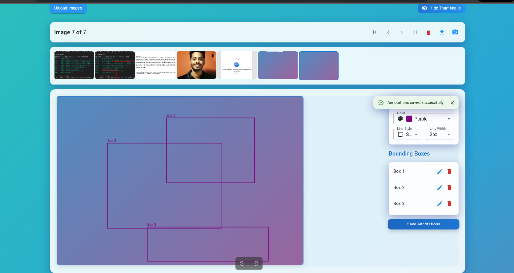
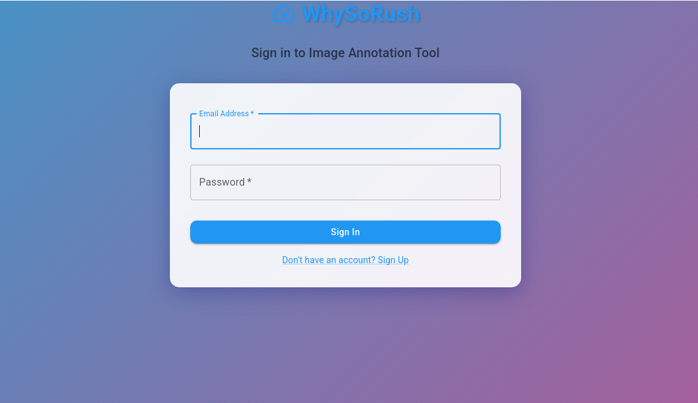
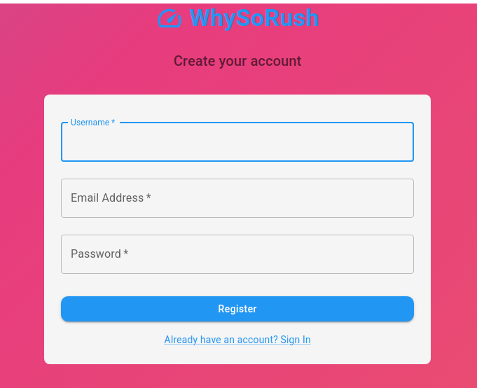

# WhySoRush - Image Annotation Tool

## Overview
WhySoRush is an image annotation tool that allows users to upload images, annotate them with bounding boxes, and save the annotations. The application provides a user-friendly interface with features such as image upload, annotation editing, and image deletion.

## Features
- **User Authentication**: Secure login and registration.
- **Image Upload**: Users can upload multiple images at once.
- **Annotation**: Draw bounding boxes on images and save annotations.
- **Image Deletion**: Delete images from the gallery.
- **Responsive Design**: Works on various screen sizes.

## Technologies Used
- **Frontend**: React, Redux, Material-UI, Framer Motion
- **Backend**: Node.js, Express, MongoDB, Mongoose
- **File Upload**: Multer for handling file uploads
- **Authentication**: JSON Web Tokens (JWT)

## Project Structure

## Installation

### Prerequisites
- Node.js
- MongoDB

### Clone the Repository
image-annotations-tool/
├── client/ # Frontend application
│ ├── public/ # Public assets
│ ├── src/ # Source code
│ │ ├── components/ # React components
│ │ ├── store/ # Redux store and slices
│ │ ├── App.js # Main application component
│ │ └── index.js # Entry point for React
│ └── package.json # Frontend dependencies
├── server/ # Backend application
│ ├── models/ # Mongoose models
│ │ ├── User.js # User model
│ │ └── Image.js # Image model
│ ├── routes/ # Express routes
│ │ └── images.js # Image routes
│ ├── middleware/ # Middleware for authentication
│ │ └── auth.js # Auth middleware
│ ├── .env # Environment variables
│ ├── server.js # Main server file
│ └── package.json # Backend dependencies
└── README.md # Project documentation

bash:image-annotations-tool/README.md
git clone https://github.com/whysorush/image-annotations-tool.git
cd image-annotations-tool

### Backend Setup
1. Navigate to the server directory:
   ```bash
   cd server
   ```
2. Install dependencies:
   ```bash
   npm install
   ```
3. Create a `.env` file in the server directory and add your environment variables:
   ```plaintext
   MONGODB_URI=your_mongodb_uri
   JWT_SECRET=your_jwt_secret
   ```
4. Start the server:
   ```bash
   npm start
   ```

### Frontend Setup
1. Navigate to the client directory:
   ```bash
   cd ../client
   ```
2. Install dependencies:
   ```bash
   npm install
   ```
3. Start the React application:
   ```bash
   npm start
   ```

## Usage
1. **Register** a new account or **log in**.
2. **Upload images** using the upload button.
3. **Annotate images** by drawing bounding boxes.
4. **Save annotations** and view them later.
5. **Delete images** as needed.

## Contributing
Contributions are welcome! Please open an issue or submit a pull request.

## License
This project is licensed under the MIT License - see the [LICENSE](LICENSE) file for details.

## Screenshots
Below are some screenshots of the application in use:




<!-- Repeat for each image inside the screenshots folder -->